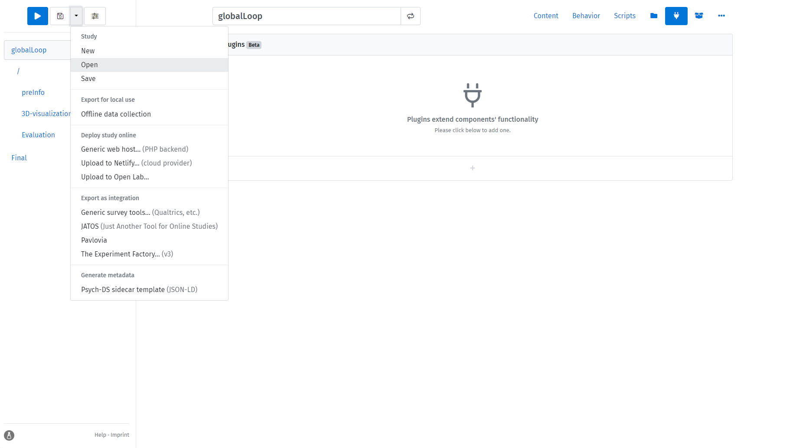

# オンライン心理学実験 `Lab.js` テンプレート集

-[English](README.md)

## はじめに

このリポジトリは、`Lab.js`をベースにした心理学実験のオープンソーステンプレート集です。
収録されているテンプレートは十分にテストされており、実験心理学研究者の実践的なニーズに合わせて拡張できる便利な基盤となることを目指しています。

## 使用方法

無料のオープンなオンライン実験作成ツール`lab.js`の一般的な説明については、[lab.js](https://lab.js.org/)を参照してください。

### テンプレートのダウンロード

このリポジトリは`lab.js`からの出力を共有しており、全てのテンプレートは簡単にインポートして適用できるJSONファイルです。
以下のコードを使用して全てのテンプレートをダウンロードできます：
```
git clone https://github.com/VldmrSlvdr/online-psy-experiment-template.git
```
または、「Download raw file」ボタンをクリックして特定のファイルをダウンロードすることもできます。

### テ��プレートのインポートと独自の研究への修正

`lab.js`ビルダーで、トップメニューからOpenボタンをクリックし、このリポジトリからダウンロードしたJSONファイルを選択します。



## テンプレート（更新中）

- [x] グローバルループ（6桁のランダム参加者IDの生成）
- [x] インフォームドコンセント
- [x] 人口統計情報入力ページ
- [x] デブリーフィングページ
- [ ] 近日公開予定...

## Acknowledgements

このリポジトリはオープンソースプロジェクトであり、あらゆる貢献とフィードバックを歓迎します。
このテンプレートが実験心理学コミュニティとコーディングに苦労している学生の皆様にとって、柔軟かつ標準化されたフォーマットとワークフローを提供し、コストを削減しつつより興味深い手法を探求できるようになることを願っています。

## License

このプロジェクトは[MITライセンス](LICENSE)の下で公開されています。
