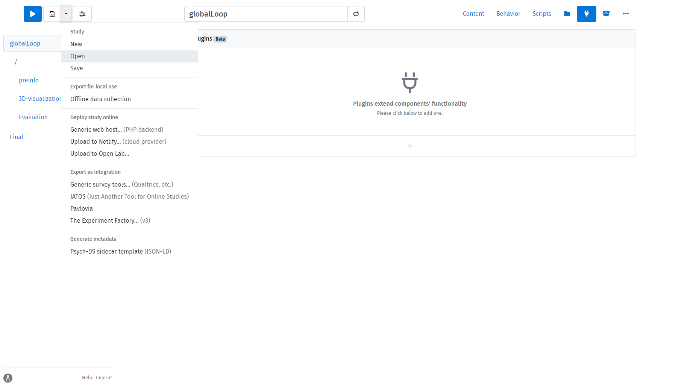

# 在线心理学实验 `Lab.js` 模板集

## 简介

本仓库是一个基于`Lab.js`的心理学实验开源模板集合。
这些精选的模板经过充分测试，旨在为实验心理学研究者提供便捷的基础模板，可以根据大多数实践需求进行扩展。

## 使用方法

关于`lab.js`（一个免费、开源的在线实验构建工具）的基本介绍，请参考[lab.js官网](https://lab.js.org/)。

### 下载模板

本仓库分享了`lab.js`的直接输出文件，所有模板都是可以轻松导入和应用的JSON文件。
你可以使用以下代码下载所有模板：
```
git clone https://github.com/VldmrSlvdr/online-psy-experiment-template.git
```
或者，点击"Download raw file"按钮下载特定文件。

### 导入模板并修改为你自己的研究

在`lab.js`构建器中，点击顶部菜单的Open按钮，选择从本仓库下载的JSON文件。



## 模板（持续更新中）

- [x] 全局循环（生成6位随机参与者ID）
- [x] 知情同意书
- [x] 人口统计信息
- [x] 实验后说明
- [ ] 更多内容即将推出...

## Acknowledgements

本仓库是一个开源项目，欢迎任何贡献和反馈。
我希望这些模板能够服务于实验心理学社区和正在为编程而苦恼的学生们，通过提供灵活且标准化的格式和工作流程来节省成本，并探索更多有趣的研究方法。

## License

本项目采用[MIT许可证](LICENSE)发布。
